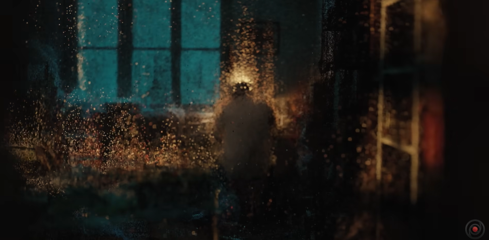

# Chen Hung - I Week8 Quiz
## Imaging Technique Inspiration

>These screenshots are excerpts from a film project. In this project, the artist uses some volatile particle effects to demonstrate the memory of his deceased grandfather.
>I really like this effect because it perfectly demonstrates a kind of dreamy atmosphere, suggesting that those memories are truly present but slowly fading away.
>This method is closely related to our chosen topic, __'Saint Georges majeur au crépuscule'__ which its creator Claude Monet based on his memories of his trip to Venice. I think this is a good way to illustrate the fading memory of Monet.

## Coding Technique Exploration

[Example link](https://p5js.org/examples/simulate-particle-system.html)

>This example is a basic p5 particle system, which I believe is crucial for achieving my desired effect. Although there are many types of particle effects in P5.js, this effect has been chosen because it serves as the foundation for every particle system and is the easiest to implement. I anticipate using this effect extensively in creating the painting from scratch. Once the structure of the painting is established with this effect, I can then incorporate additional interactive effects such as Flocking or smoke particles based on this function.
